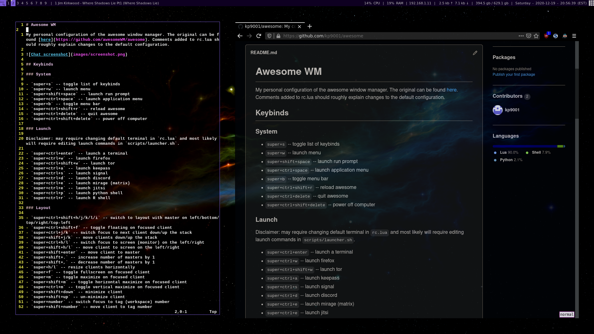

# Awesome WM

My personal configuration of the awesome window manager. The original can be found [here](https://github.com/awesomeWM/awesome). I have a slightly different configuration which I use for my laptop [here](https://github.com/kp9001/awesome). Comments added to rc.lua should roughly explain changes to the default configuration. 


## Keybinds

### System

- `super+s` -- toggle list of keybinds
- `super+w` -- launch menu
- `super+shift+space` -- launch run prompt
- `super+ctrl+space` -- launch application menu
- `super+b` -- toggle menu bar
- `super+ctrl+shift+r` -- reload awesome
- `super+ctrl+delete` -- quit awesome
- `super+ctrl+shift+delete` -- power off computer

### Launch

Disclaimer: may require changing default terminal in `rc.lua` and most likely will require editing launch commands in `scripts/launcher.sh`.

- `super+ctrl+enter` -- launch a terminal
- `super+ctrl+w` -- launch firefox
- `super+ctrl+shift+w` -- launch tor
- `super+ctrl+a` -- launch keepass
- `super+ctrl+s` -- launch signal
- `super+ctrl+d` -- launch discord
- `super+ctrl+e` -- launch mirage (matrix)
- `super+ctrl+e` -- launch jitsi
- `super+ctrl+p` -- launch python shell
- `super+ctrl+r` -- launch R shell

### Layout

- `super+ctrl+shift+h/j/k/l/i` -- switch to layout with master on left/bottom/top/right/top-left
- `super+ctrl+shift+f` -- toggle floating on focused client
- `super+ctrl+j/k` -- switch focus to next client down/up the stack
- `super+shift+j/k` -- move clients down/up the stack
- `super+ctrl+h/l` -- switch focus to screen (monitor) on the left/right
- `super+shift+h/l` -- move client to screen on the left/right
- `super+shift+enter` -- move client to master
- `super+shift+.` -- increase number of masters by 1
- `super+shift+,` -- decrease number of masters by 1
- `super+h/l` -- resize clients horizontally
- `super+f` -- toggle fullscreen on focused client
- `super+m` -- toggle maximize on focused client 
- `super+shift+m` -- toggle horizontal maximize on focused client 
- `super+ctrl+m` -- toggle vertical maximize on focused client 
- `super+shift+down` -- minimize client
- `super+shift+up` -- un-minimize client
- `super+number` -- switch focus to tag (workspace) number
- `super+shift+number` -- move client to tag number
- `super+ctrl+number` -- toggle view tag number on current tag

### Music (mocp)
- `super+space` -- toggle pause on mocp
- `super+p` -- begin playlist on mocp
- `super+n` -- move to next track on mocp
- `super+shift+n` -- move to previous track on mocp
- `super+right` -- seek forward on current track
- `super+left` -- seek backwards on current track

These tools assume you have a playlist saved in the program mocp. You can install this with `sudo apt install moc moc-ffmpeg-plugin` and learn how to use it with `mocp --help`, or by pressing `?` inside the `mocp` terminal interface. There is also a `super+shift+ctrl+m` bind to open ranger in the directory `~/music` to search for songs for form a playlist. This is used in conjunction with a ranger configuration which has its own keybinds to create mocp playlists. 

### Screenshots

- `print` -- screenshot everything (all screens)
- `super+print` -- screenshot active client
- `shift+print` -- select region to screenshot

### Recording

- `super+control+print` -- launch terminal with interactive prompts to being screen/webcam recordings

Screenshots will by default be saved in `~/pictures/.screenshots` and recordings will be saved in `~/videos/.recordings`. These directories will be created if they do not exist. In order to take advantage of these features, please read the relevant details in the add ons section!

### Volume

Volume up/down keys perform their normal function. This can be changed to any keys in `rc.lua`. Search for "volume controls".

## Installation

Awesome can be installed from your linux repository on debian, arch, and fedora based distros. 

```
sudo apt install awesome
sudo pacman -S awesome
sudo dnf install awesome
```

or it can be built following instructions on the original awesome git repository [here](https://github.com/awesomeWM/awesome). To copy this confuguration, clone the git repository into your `.config`

```
cd ~/.config
git clone https://github.com/kp9001/awesome.git
cd awesome
```

This configuration has some additional dependencies, namely

```
sudo apt install feh xcompgr unclutter curl
```

At minimum, you will probably want a wallpaper, so run

```
sudo cp scripts/fehbg /usr/bin
```

To set a wallpaper, simply move an image into the directory `~/pictures/wallpapers`. If you wish, you may put multiple wallpapers in to the `~/pictures/wallpapers` directory. If you do this, then each time you restart awesome, a random one will be selected. To change to a new random wallpaper, use `super+ctrl+b`.

Please refer to the Notes section at the end for important additional notes.  

## Add ons

In order to take full advantage of the custom configuration (for instance, screenshots), you will need to install a few more dependencies:

```
sudo apt install maim xclip xdotool xterm ffmpeg 
```

You can now move scripts as you wish from the `scripts` directory to `/usr/bin` in order to take advantage of extra features. For everything, you can run

```
cd scripts
sudo cp record recorder mailsync weather /usr/bin
```

Please note the following before copying:

For `recorder`, you will need to manually input the values for the variables `RES`, `AUDIO` and `MIC`. These should respectively be the resolution of your monitor, the audio output source, and the audio input source. To find the names of the latter two, assuming you are using pulseaudio, you can run `pactl list sources`. You are interested in the `Name` entries.

For `weather`, you may wish to edit according to the note in the file. If not, it will default to the weather in your current IP location. Due to admittedly bad design, the temperature unit is hardcoded into the widget. Search for `Right widgets` in `rc.lua` and you will see where you can modify this. 

Finally, `mailsync` will automtaically sync your email in the background, if you are using mutt and mbsync. If not, you should remove the lines with `mailsync` from your autostart list. 

## Notes

Other things you might want to modify before loading: 

- You may wish to remove from, add to, or modify the autorun section at the end of `rc.lua`. 
- The keybinds for `move_to_screen` are based on my monitor setup. The default binding is commented out beneath my modified bindings. 
- The widgets, especially the network ones, are set up specifically for my system. You may wish to modify some arguments so they work for you. Search for `Wibar` in `rc.lua`. For instance, you will want to change all instances of `enp2s0` to your network connection, perhaps `eth0` or `wlan0`. 
- In order for the weather widget to work, you must copy the `weather` script to `/usr/bin`, or else change it in `rc.lua`, replacing the command `weather` with `curl -s wttr.in`.

If all went well, awesome should now load with this configuration without errors, and with your wallpaper. If you wish to make any changes, open up `rc.lua` in your favorite editor and have fun. Press `super+ctrl+r` to reload awesome (unless you modified this already). 

If you wish to check out other themes, the default themes have been copied into the themes directory. You may try them out by editing the line just after "variable definitions" in `rc.lua` which currently reads 

```
local theme_path = string.format("%s/.config/awesome/themes/%s/theme.lua", os.getenv("HOME"), "xresources")
```

You want to replace `xresources` with other theme names. 

You may also wish to modify the application launcher. Read the script called `launcher` in the scripts directory. Adding new applications to this require adding cases to the case list (the names are irrelevant) and adding corresponding lines to the bottom with whatever command calls the application. (To that effect, you can run any command this way.) You then must go into the keybinds section of `rc.lua` and assign a keybind to `launcher.sh` with some argument. Use the syntax of the ones currently in the config as a template. 

## Other

For ease of installation on new systems, I have included miscellaneous config files in `other`. In order to use these, run

```
cd ~/.config/awesome/other
sudo apt install vim ranger zathura zathura-pdf-poppler moc moc-ffmpeg-plugin
sudo cp vim/vimrc /etc/vim/
cp ranger/rc.conf ~/.config/ranger/
cp zathura/zathurarc ~/.config/zathura/
cp mocp/config ~/.moc/
```

In liue of a personal mutt configuration, I am using Luke Smith's brilliant [Mutt Wizard](https://github.com/lukesmithxyz/mutt-wizard).

## Screenshots



